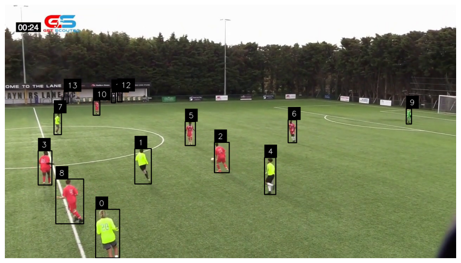
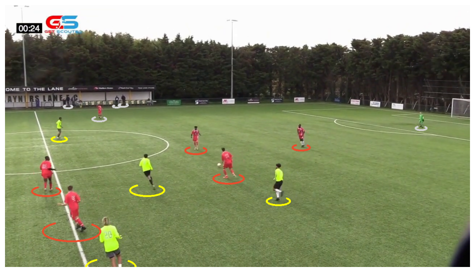

# GRASSROOT FOOTBALL ANALYSIS

## Project Objective

The **Grassroot Football Analysis** project aims to develop a comprehensive system for analyzing grassroots football match videos using advanced **AI techniques** and **Big Data infrastructure**. By leveraging state-of-the-art **player detection, tracking, and performance analysis tools**, this initiative seeks to support training strategies, improve player development, gain tactical insights, and enhance fan engagement.

This project integrates:
- **Player tracking, speed estimation, and ball movement analysis**
- **Automatic team identification using clustering**
- **Big Data management for large-scale football video datasets**
- **Tactical analysis to improve performance and game strategies**

You can have access to the report here:
📄 **[Project Report](Report/Grassroot_football_analysis_Report.pdf)**


---

## Features

✅ **Player Detection & Tracking**: Identifies and follows players using **YOLOv5 & YOLOv8**  
✅ **Camera Motion Estimation**: Adjusts player positions for accurate tracking  
✅ **Field View Transformation**: Corrects perspective distortions for an ideal tactical view  
✅ **Ball Position Interpolation**: Estimates ball location when not directly visible  
✅ **Player Speed & Distance Estimation**: Analyzes movement patterns and fitness levels  
✅ **Team Classification via Clustering**: Uses **K-Means clustering** to automatically group players by team colors  
✅ **Ball Possession Analysis**: Determines which team controls the ball  
✅ **Big Data Video Management**: Handles **500+ grassroots match videos** for long-term tracking and analysis 

---

## Installation

### 1️⃣ Clone the Repository
```bash
git clone https://github.com/Amiche02/Grassroot_football_video_analysis.git
cd Grassroot_football_video_analysis & cd Advanced-Football-Video-Analysis
```

### 2️⃣ Install Dependencies
```bash
pip install -r requirements.txt
```

### 3️⃣ Download Pre-trained Models
```bash
wget https://www.dropbox.com/scl/fo/hybscdrucozk29pbda15u/AN3zedKh1YYlkVtnXFH13Vk?rlkey=8rr5owurn3mu6pfarofh7tctq&st=s96ogmos&dl=0 -P models/
```

---

## Usage

1️⃣ **Place input videos** in the `input_videos/` folder.

2️⃣ **Run the main script** to analyze the videos:
```bash
python main.py
```

3️⃣ **Output videos** will be saved in the `output_videos/` folder.

---

## Results & Visualizations

### 🎯 **Player Detection Example**
Detecting and tracking players using YOLO models:



---

### 🔵🔴 **Team Separation via Clustering**
Automatically assigning players to teams based on jersey color:

  
  

---

### 🎥 **Match Analysis Results**


---

## Contribution

We welcome contributions! Feel free to:
- **Open an issue** for bugs or feature requests.
- **Submit a pull request** if you improve or optimize the code.

---

## Conclusion

The **Grassroot Football Analysis** project represents a significant step in applying **AI and Big Data** to grassroots football. By analyzing extensive match videos, we aim to **refine training methods, enhance player development, and provide deeper insights into team strategies**.

As we continue improving, we encourage the **football and AI communities** to join us—whether through data contributions, technical enhancements, or sharing insights. Together, we can unlock new potential in grassroots football analytics! ⚽📊🚀  

🔔 **Stay tuned for more updates!**